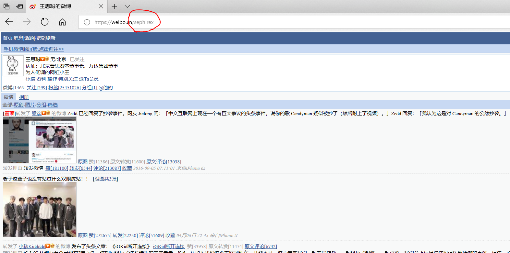
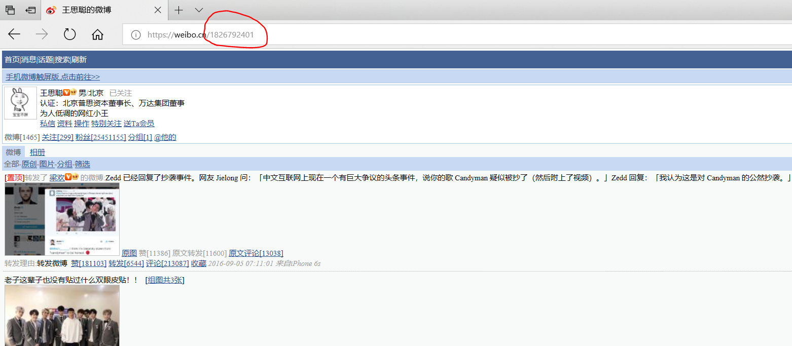
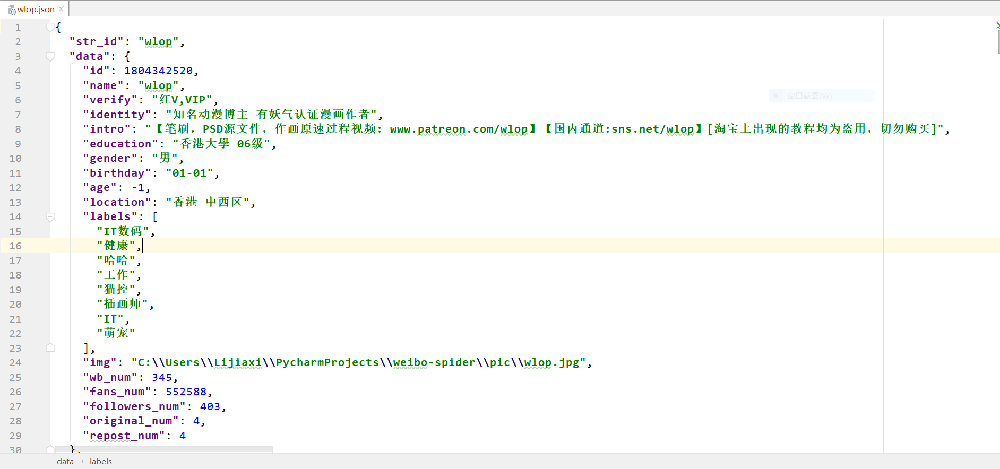
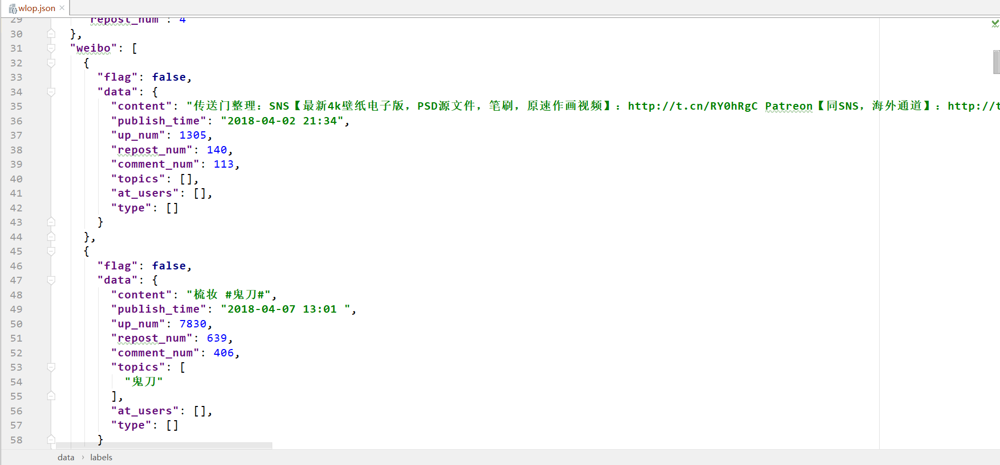
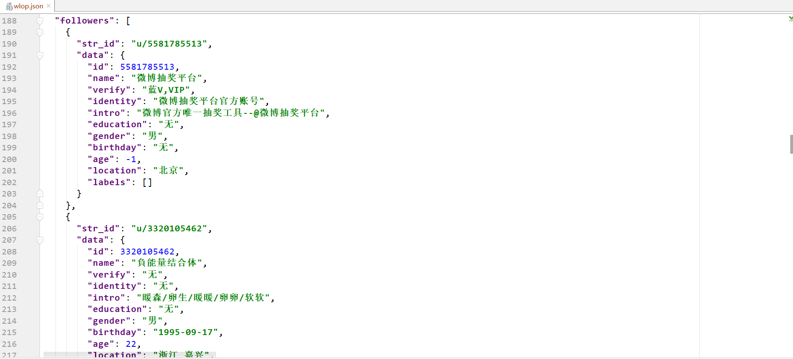
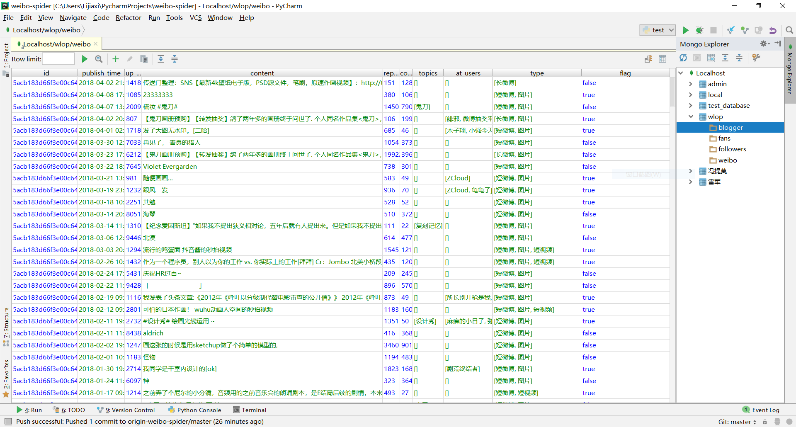

# weibo-spider

## 简介
>简单的新浪微博爬虫，纯python实现，未使用框架。

>爬取一名用户在新浪微博上的全部信息，包括用户个人信息，发布的微博，用户关注者，用户粉丝。
并将其存放在MongoDB中

## 输入
1.需要用户手动获取登陆新浪微博的cookies 
>[模拟登录新浪微博（直接填入Cookie）](https://www.douban.com/note/264976536/?start=0#32893498)

2.想要爬取用户的id
>字符id 

>数字id 
两种皆可
## 输出
以爬取的用户昵称命名的json文件。示例如下：
>
>
>

增添新功能，可以将用户信息存放在MongoDB中
>
## 数据段
>**User的数据段，希望爬取的博主，及其关注者和粉丝**

| 段域 | 数据类型 | 含义 | 
|-------------|-------------|------------|
| str_id | string | 最初传入的用户id，一般情况下数字，但某些大v也有字符串的id |
| id | int | 用以唯一标识用户的数字id | 
| name | string | 用户昵称|
| verify | string | 认证类型 | 
| identity | string | 认证信息 | 
| intro | string | 个人简介 | 
| education | string | 教育信息 |
| gender | string  | 性别 | 
| birthday | string | 生日 | 
| age | int | 年龄，若未设置则为-1 |
| location | string | 地理位置 |
| labels | list | 用户的标签信息|
>**Blogger的数据段，Blogger是User的子类，即是我们爬取的目标，在拥有以上数据段外还有额外的数据段**

|段域|数据类型|含义|
|----------|----------|---------|
| img | string | 爬取的博主头像文件的地址。一般是将其放在./pic文件夹下/
| fans_num | int | 粉丝数目 | 
| followers_num | int | 关注数目 | 
| wb_num | int | 发布微博数目，但是并不一定能全部爬取 | 
| original_num | int | 以爬取的原创微博数目 | 
| repost_num | int | 以爬取的转发微博数目 | 
| weibo | list | 博主所发微博
| followers | list | 博主关注的人 |
| fans | list |博主的粉丝|  

 >**Weibo数据段，博主发布的微博**
 
| 段域 | 数据类型 | 含义 |
|------|-------|------|
| flag | bool | 判断该条微博是否是转发 |
| content | string | 微博内容 |
| publish_time | stirng | 发布时间 |
| up_num | int | 点赞数 |
| repost_num | int | 转发数 |
| comment_num | int | 评论数 |
| topics | list | 微博中参与的话题 |
| at_users | list | 微博中@的用户 |
|type | list | 微博类型：短微博，长微博，图片，视频，文章|

